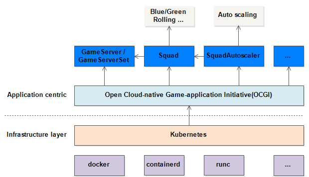

# Open Cloud-native Game-application Initiative

Open Cloud-native Game-application Initiative(OCGI) is a runtime-agnostic specification for deploy cloud native game applications.

## Introduction

### The key feature of OCIG

- Provide a general back-end server abstraction for game scenarios. It can support the abstraction of game backend services such as Game Server and Dedicated Server.
- Simplify the management of underlying network resources (CLB/EIP).
- Provide AutoScaling for these back-end services.
- Elastic scaling of the K8s cluster dimension.
- Complete resource isolation scheme.Such as, CPU, memory, disk, IO, network, etc.
- Complete back-end service observability scheme. Such as, log, monitoring, call chain tracking, etc.
- Support multi-cluster unified deployment.
- Cost optimization service.
- Solutions such as hyprid deployment and CPU utilization improvement.